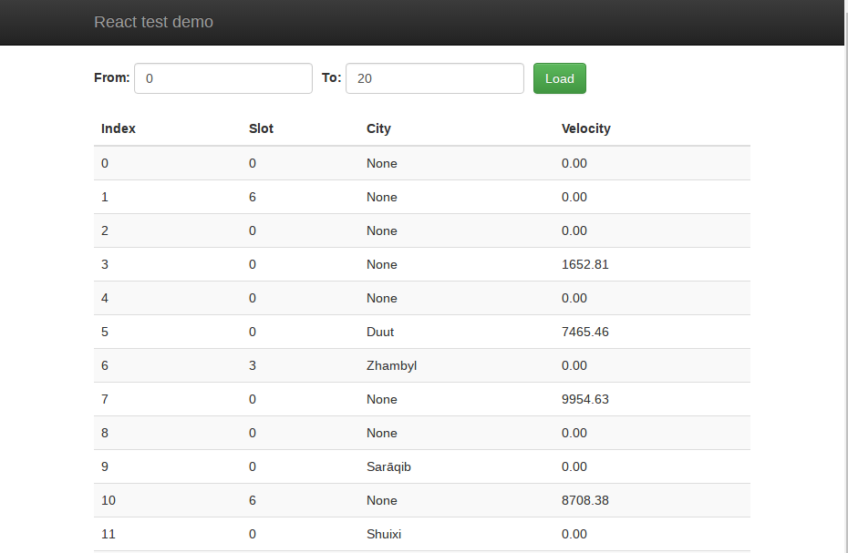

# Frontend test

### Your task

Create a react app that displays tabular data loaded from a JSON API.

Data is formatted like this:

```json
{
	"index": 5,
	"slot": 8,
	"city": "New York",
	"velocity": 15.00
}
```

Any of the fields except `index` can be `null`. In that case, data should be displayed like this:

- For `slot`, it should display `0`
- For `city`, it should say `"None"`
- For `velocity`, it should display `0.00`

User should be able to select a range of indexes to display (`from` and `to` fields). The initial range should be 1-20.

If there is an error, user should be shown the error message.

The finished product should look something like this:




### API

The API URL is: [http://localhost:3000/api](https://ossified-coil.glitch.me/data)

It has 2 endpoints.

#### /api/token

Call this endpoint to obtain the API token. You will need this to execute any other requests.

The response will be formatted like this:

```json
{
	"token": "8324544624405497"
}
```

Note that this endpoint is slow and **it will take 5 seconds** to get a response. You should use this as sparingly as possible.

#### /api/data

Get array with data items.

The endpoint accepts 3 query parameters:

- `from`: Lower bound index in returned data, inclusive. Range: 1-1000
- `to`: Upper bound index in returned data, inclusive. Range: 1-1000
- `token`: Active API token, provided either by `/api/token` endpoint or by previous successful `/api/data` call.  

The response will be formatted like this:

```
{
	"data": [
		{"index":104,"slot":8,"city":"Carleton Place","velocity":265.68},
		{"index":109,"slot":1,"city":null,"velocity":5268.7},
		(...)
	],
	"token": '8324544624405497'
}
```

- `data` is an array of data points. Data will always be sorted by `index`, in ascending order.
- `token` is a replacement token that should be used in your next request.

**Tokens can be used only once**. You must always save token from the previous successful request and use it in the next one.

**Clients that make a request with an expired token will be banned for 30 seconds**.

#### Error responses

If there is an error, it will be returned like this:
```
{
	"error": {
		"message": "There was an internal error"
	}
}
```
Status code will be provided in the HTTP response.

Following status codes are supported:

- **400 Client error**  
    Validation or similar issue. This error should be displayed to the user. Token is not invalidated. Next request can be with the same token.

- **401 Unauthorized**  
    Client's token is not valid and should be thrown away. Client can call the `/token` endpoint and obtain a new token.

- **403 Forbidden**  
    Client is banned from accesing the server for some time. Token is invalidated, but calling the `/token` endpoint will result in error.

- **500 Internal server error**  
	The server has crashed. Client should discard its token and try obtaining a new one. 

### Additional notes

- Test will last between 1 and 2 hours.

- The test should be done using react.js. Build systems and additional libraries are allowed, but not required.

- Browser compatibility isn't important (target Chrome).

- Googling is allowed.

- Visuals aren't important. You should throw in enough CSS to make the app usable, but don't waste too much time on it.
 
- Your goal should be that the user has to wait as little as possible. So, call the `/token` endpoint sparingly, and never trigger the 30 second ban.

- Reference solution can be seen in action [here](https://ossified-coil.glitch.me/solution). Examining its source code is not allowed.

- The code should be organized to the best of your ability. Try to do production-quality work.

- Stretch goals: Client side validation, unit testing.
